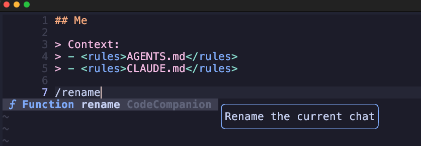
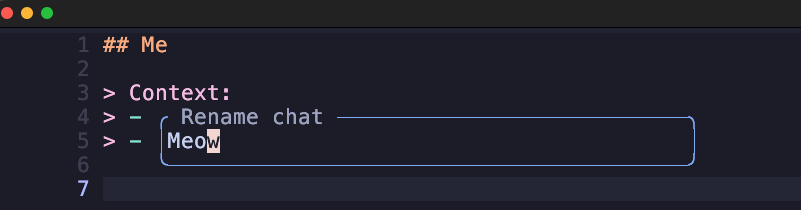

# codecompanion-rename.nvim

A [codecompanion.nvim](https://github.com/olimorris/codecompanion.nvim) extension that adds a `/rename` slash command to chat buffers. Custom names persist across ACP sessions and are shown in the `/resume` picker.

## Installation

```lua
-- lazy.nvim
{
  "mmcdanielq/codecompanion_rename_slash_command",
  dependencies = { "olimorris/codecompanion.nvim" },
}
```

Or configure the extension directly via lazy's `opts`:

```lua
{
  "olimorris/codecompanion.nvim",
  opts = {
    -- ...
    extensions = {
      rename = {
        enabled = true,
        opts = {
          ttl_days = 90,   -- days before a stored title expires (default: 90)
          data_path = nil, -- override the JSON storage path (default: see below)
        },
      },
    },
    -- ...
  },
}
```

Or via a standalone `require` call:

```lua
require("codecompanion").setup({
  extensions = {
    rename = {
      enabled = true,
      opts = {
        ttl_days = 90,   -- days before a stored title expires (default: 90)
        data_path = nil, -- override the JSON storage path (default: see below)
      },
    },
  },
})
```

### Options

| Option | Type | Default | Description |
|--------|------|---------|-------------|
| `ttl_days` | `number` | `90` | Days before a stored session title expires and is pruned |
| `data_path` | `string` | `~/.local/share/nvim/codecompanion/session_titles.json` | Path to the JSON file where session titles are stored |

## Usage

**`/rename`** — rename the current chat buffer.



- With an inline argument: `/rename My project refactor`
- Without an argument: opens an input prompt pre-filled with the current title



Works with both HTTP and ACP adapters. With ACP, the name is persisted to disk and restored when the session is resumed via `/resume`.

**`/resume`** — the built-in command is overridden to show custom names in the session picker.

## How it works

- Custom titles are stored at `~/.local/share/nvim/codecompanion/session_titles.json`
- Titles expire after 90 days
- Stale entries (sessions no longer on the server) are pruned each time `/resume` is opened
- ACP `session_info_update` pushes cannot overwrite a manually set title
